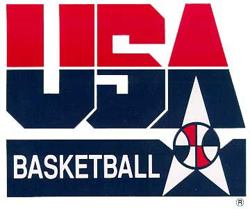

# Scrollytelling and the 1992 Dream Team 

Scrollytelling is an interactive and engaging form of journalism that
brings stories and data to life. When I experienced this for the first
time, reading the article “[Table for
One](https://pudding.cool/2017/07/eating-alone/)” by *The Pudding*, I
was left in awe. Words appeared and visuals changed simply by
scrolling…how did they do that\!?

Well, I still don’t know exactly how it works, but John Coene’s
[scrollytell](https://github.com/JohnCoene/scrollytell) package in R has
allowed me to create a scrollytelling
[article](sdavis.shinyapps.io/dream_team/) in Shiny about the 1992 Dream
Team. The data and source code that created this app can be found in
this repo.  

